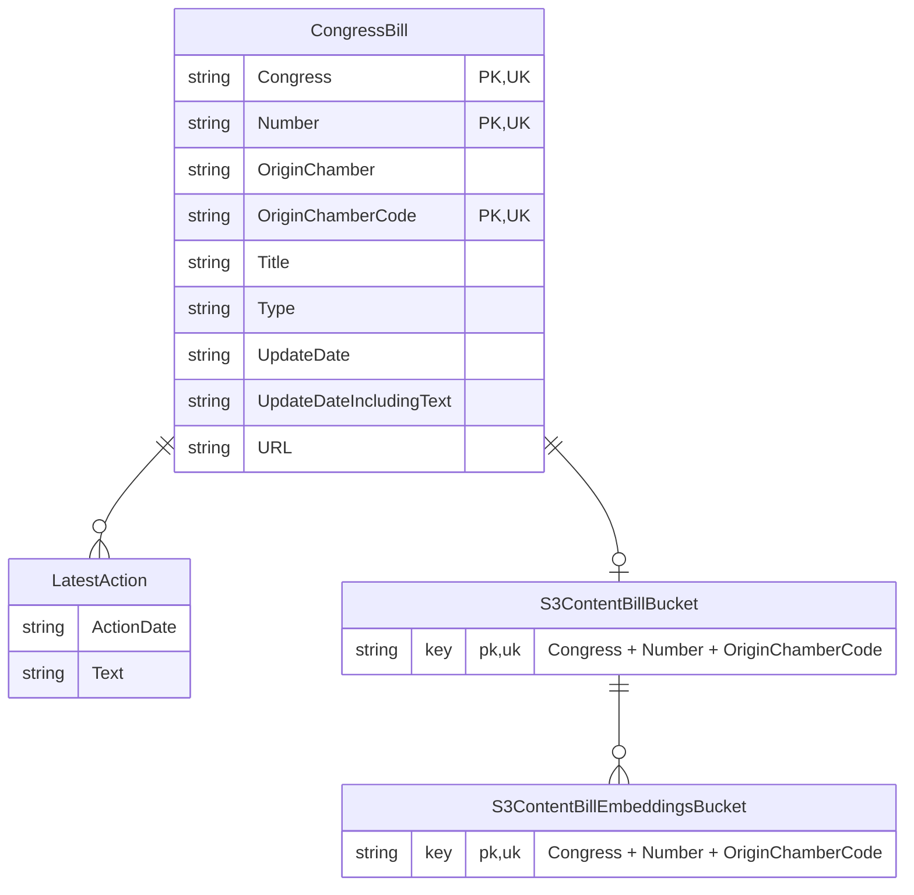

```mermaid
erDiagram
    CongressBill {
        string Congress PK, UK
        string Number PK, UK
        string OriginChamber
        string OriginChamberCode PK, UK
        string Title
        string Type
        string UpdateDate
        string UpdateDateIncludingText
        string URL
    }

    LatestAction {
        string ActionDate
        string Text
    }

    CongressBill ||--o{ LatestAction : ""

    S3ContentBillBucket {
        string key pk, uk "Congress + Number + OriginChamberCode"
    }

   S3ContentBillEmbeddingsBucket {
        string key pk, uk "Congress + Number + OriginChamberCode"
    }


    CongressBill ||--o| S3ContentBillBucket : ""
    S3ContentBillBucket ||--o{ S3ContentBillEmbeddingsBucket : ""
```

