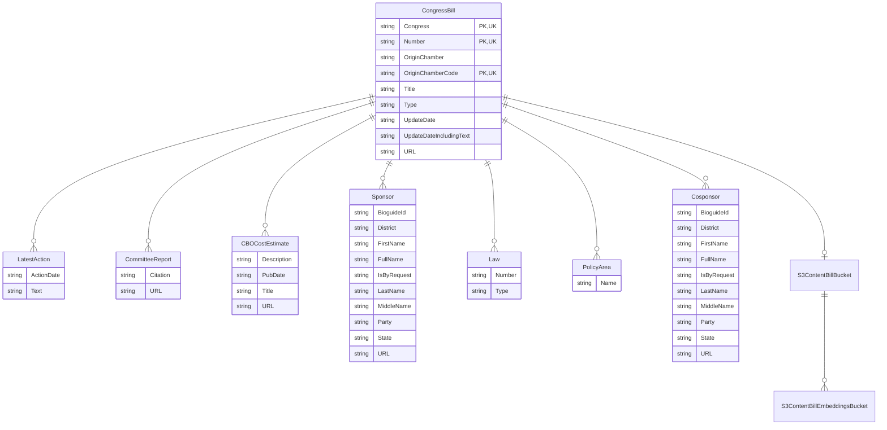
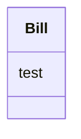

# ERD


```mermaid
erDiagram
    CongressBill {
        string Congress PK, UK
        string Number PK, UK
        string OriginChamber
        string OriginChamberCode PK, UK
        string Title
        string Type
        string UpdateDate
        string UpdateDateIncludingText
        string URL
    }
    LatestAction {
        string ActionDate
        string Text
    }
    CongressBill ||--o{ LatestAction : ""
    CommitteeReport {
        string Citation
        string URL
    }
    CongressBill ||--o{ CommitteeReport : ""
    CBOCostEstimate {
        string Description
        string PubDate
        string Title
        string URL
    }
    CongressBill ||--o{ CBOCostEstimate : ""
    Sponsor {
        string BioguideId
        string District
        string FirstName
        string FullName
        string IsByRequest
        string LastName
        string MiddleName
        string Party
        string State
        string URL
    }
    CongressBill ||--o{ Sponsor : ""
    Law {
        string Number
        string Type
    }
    CongressBill ||--o{ Law : ""
    PolicyArea {
        string Name
    }
    CongressBill ||--o{ PolicyArea : ""
    Cosponsor {
        string BioguideId
        string District
        string FirstName
        string FullName
        string IsByRequest
        string LastName
        string MiddleName
        string Party
        string State
        string URL
    }
    CongressBill ||--o{ Cosponsor : ""


    CongressBill ||--o| S3ContentBillBucket : ""
    S3ContentBillBucket ||--o{ S3ContentBillEmbeddingsBucket : ""
```

# Class Diagram


```mermaid

classDiagram
    class Bill {
        test
    }

```

# Sequence Diagram

## 

```mermaid

```